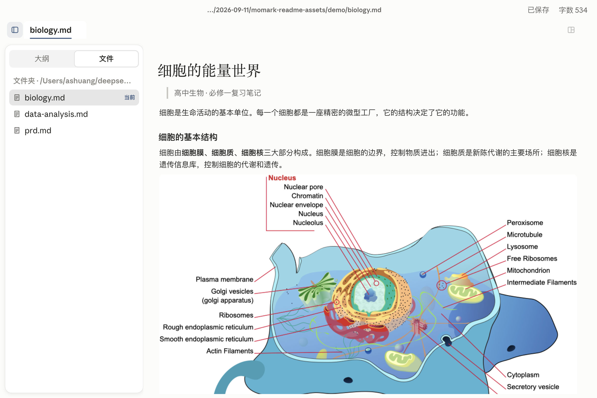
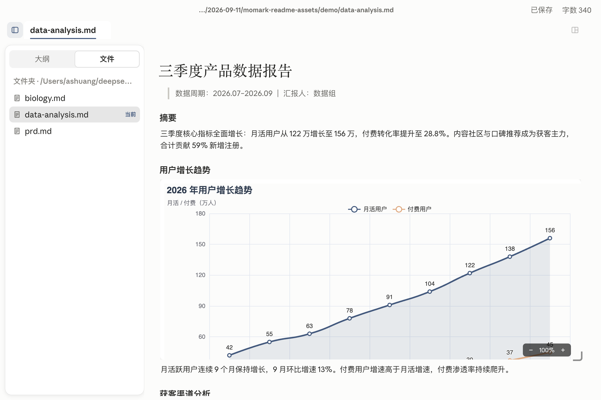
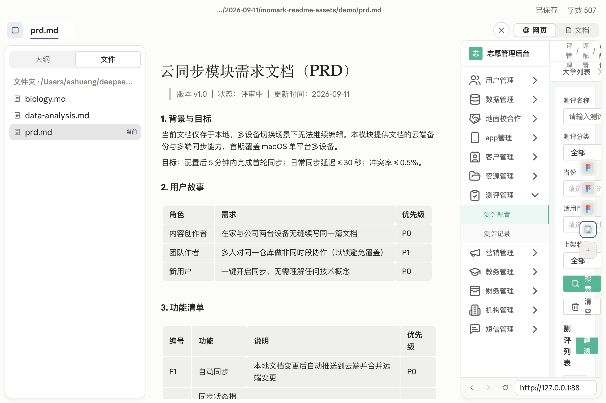

<p align="center">
  
</p>

<h1 align="center">墨记 MoMark</h1>

<p align="center">
  一款为 macOS 打造的极简、专注的 Markdown 编辑器
</p>

<p align="center">
  
  
  
  
</p>

## 特色

### 标签拖拽分屏

标签页拖拽即可把文档放入右栏，左右双文档并行编辑——对照资料、迁移内容、边写边改。分屏边距经过精心调校，滚动条居中于分隔带，不侵占正文。

### 网页 / 文档双模右栏

右侧面板在「网页」与「文档」之间一键切换：一边浏览网页资料，一边随手把内容整理进左侧文档。

### HTML 代码块内嵌渲染

HTML 代码块不再是一段源码，而是真实渲染的画面——数据图表、交互式原型直接显示在文档里。右下角控制条支持 50%–200% 缩放，拖拽即可调整视口大小。

### 块级编辑内核

基于块（block-based）的 Markdown 编辑内核：结构化的文档模型、精确的增量更新与顺滑的光标操作，为表格、图表、内嵌预览等扩展能力提供了统一底座。

### 为中文写作打磨

针对中文输入做过系统性优化：表格单元格 IME 输入全链路修复，软换行场景下输入法提交的内容完整保留——中文写作不丢字、不跳光标。

### 墨蓝极简设计

以墨蓝为主色的极简设计语言：克制的配色、非对称的侧栏动效、滚动时若隐若现的细线滚动条——界面让位于内容。

### 纯净中文体验

界面全量中文，开箱即用；运行时数据独立存放，与其他编辑器互不干扰。

## 效果预览

**图文笔记** —— 生物复习笔记，彩色插图与表格混排：



**数据分析报告** —— 交互图表直接渲染进文档，悬停即看数值：



**对照写 PRD** —— 左侧写需求文档，右侧同步对照设计稿：



## 安装

下载构建产物，将 `墨记.app` 拖入「应用程序」。

> macOS 版本当前未做公证签名，首次打开若提示「已损坏」，执行：
>
> ```bash
> xattr -cr /Applications/墨记.app
> ```

## 从源码构建

前置要求：Node.js ≥ 20.19（推荐 22）、pnpm ≥ 10

```bash
pnpm install
pnpm build:mac          # 默认 arm64；另有 build:mac:x64
```

产物：

- 应用：`dist/mac-arm64/墨记.app`
- 安装包：`dist/momark-mac-arm64-1.1.0.dmg` / `dist/momark-mac-arm64-1.1.0.zip`

## 开发

```bash
pnpm dev      # 开发实例，渲染进程运行于 localhost:9333
```

技术栈：Electron · Vue 3 · Pinia · TypeScript，pnpm monorepo 组织桌面端与编辑内核。

## 项目结构

| 目录               | 说明                                 |
| ------------------ | ------------------------------------ |
| `packages/desktop` | Electron 桌面端（主进程 + 渲染进程） |
| `packages/muya`    | 块级编辑内核（TypeScript）           |
| `packages/muyajs`  | 编辑内核构建产物                     |
| `packages/website` | 官网 / 文档站                        |
| `docs/`            | 架构、分支规范、路线图等文档         |

## 文档

- [架构说明](docs/ARCHITECTURE.md)
- [路线图](docs/ROADMAP.md)

## License

[MIT](LICENSE)

> 效果预览中的生物学插图来自 Wikimedia Commons（公有领域 / CC BY-SA 3.0），逐图来源与授权见 [docs/screenshots/figure-sources.txt](docs/screenshots/figure-sources.txt)。
